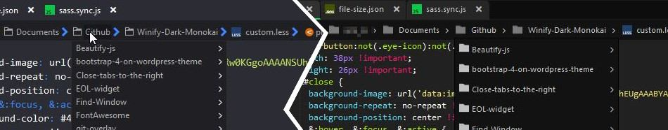

# K11 Darksome - Monokai
A K11 customized dark skin with a Monokai color-scheme and Spotify green accents.
 
## Screenshot

## features

### Tabs
The file tabs have undertaken a small restyling.   

### Places widget
The places widget have gotten other kind of folder icons and removed the chevron.

### Breadcrumbs
The breadcrumbs got a restyling, also the folder and file icons are added.

### File-picker
In the remote file/folder-picker are now folder and file icons.

### Toolbox
In th toolbox window are folder icons added.

### Open files widget
The open files widget also got a bit of a restyle.

### Menu
The main menu has some more padding.

### Vertical tabs layout
The vertical tabs layout has gotten some improvements.

### Restyling of the window controls
The window buttons are restyled to be more slick and got a small rasta theme.

